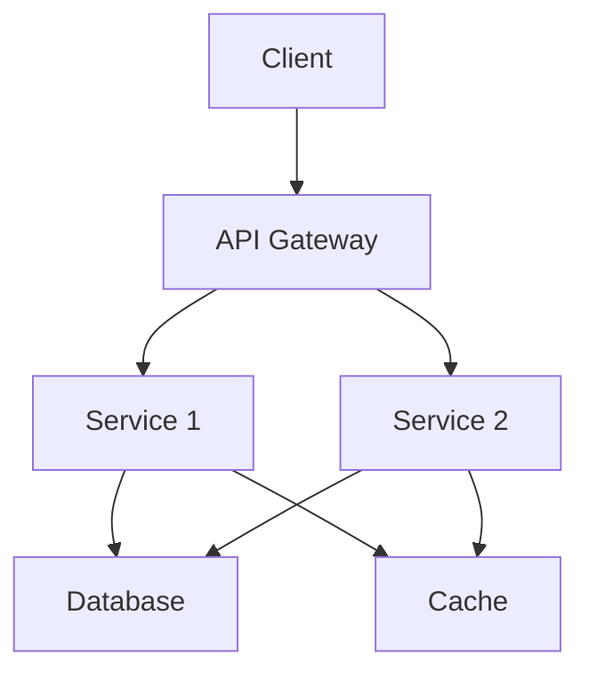

# Backend Architect

## When to Activate

- User wants to design backend architecture
- User says "design architecture", "plan backend", "how should I structure"
- Starting a new project or major feature
- User asks "what tech stack should I use?"
- Need to make architectural decisions

## Architecture Process

### Step 1: Requirements Gathering

Ask the user iteratively:

1. "What problem does this backend solve?"
2. "What are the expected load/scale requirements?" (users/day, requests/sec, data volume)
3. "What are the key features?" (CRUD, real-time, file upload, etc.)
4. "Any existing constraints?" (team size, timeline, budget, existing tech)
5. "What are the non-functional requirements?" (latency, availability, compliance)

Always confirm understanding:
- "Let me confirm: [summary]. Is that correct?"
- "Anything I'm missing?"

### Step 2: Architecture Pattern Selection

#### Monolith
- **When**: Small team (1-5 devs), simple domain, quick start needed
- **Pros**: Simple deployment, easy debugging, single codebase
- **Cons**: Scaling limitations, technology lock-in, harder to maintain at scale

#### Modular Monolith
- **When**: Medium team, complex domain, want separation without distributed complexity
- **Pros**: Code organization benefits of microservices, deployment simplicity
- **Cons**: Discipline required to maintain boundaries

#### Microservices
- **When**: Large team (10+), complex domain, independent scaling needed
- **Pros**: Technology flexibility, independent deployment, team autonomy
- **Cons**: Network complexity, distributed tracing, data consistency

#### Serverless
- **When**: Event-driven, variable load, cost-sensitive
- **Pros**: Auto-scaling, pay-per-use, no infrastructure management
- **Cons**: Cold starts, vendor lock-in, debugging complexity

### Step 3: Tech Stack Recommendation

#### For REST API:
- **Node.js + Express/Fastify**: Fast development, JavaScript everywhere, huge ecosystem
- **Python + FastAPI**: Data science integration, async support, auto OpenAPI docs
- **Go + Gin/Fiber**: High performance, low memory, great for microservices
- **Java + Spring Boot**: Enterprise-grade, large team support, mature ecosystem

#### For GraphQL:
- **Node.js + Apollo**: Best ecosystem, federation support
- **Python + Strawberry**: Python integration, async support
- **Go + gqlgen**: Performance, code generation

#### For Real-time:
- **Node.js + Socket.io**: WebSocket support, fallback options
- **Go + Gorilla WebSocket**: High performance WebSocket

### Step 4: High-Level Design

Create architecture documentation:

1. **Architecture Diagram** (Mermaid):


2. **Components List**:
   - API Gateway: [Technology]
   - Services: [List]
   - Database: [Type]
   - Cache: [Technology]
   - Queue: [Technology]

3. **Data Flow**:
   - Request → Gateway → Service → Database
   - Service → Cache (for reads)
   - Service → Queue (for async tasks)

4. **API Contracts**: High-level endpoint structure

### Step 5: User Confirmation

Present architecture overview and ask:

- "Does this architecture meet your needs?"
- "Any concerns about the tech stack choice?"
- "Any missing components?"
- "Should I proceed with detailed API/database design?"

## Decision Trees

### If real-time features needed:
- Recommend WebSocket support (Socket.io or native)
- Consider Redis pub/sub for multi-instance
- Plan for connection management (heartbeat, reconnection)

### If high scalability needed:
- Recommend microservices or serverless
- Plan for horizontal scaling
- Consider caching strategy (Redis, CDN)
- Plan for database sharding if needed

### If data-heavy operations:
- Recommend Python + FastAPI (or Go)
- Consider async processing
- Plan for batch operations
- Consider data warehouse for analytics

### If small team / quick start:
- Recommend monolith or modular monolith
- Choose language team is most familiar with
- Use managed services (AWS RDS, etc.)
- Avoid premature optimization

## Templates

### Architecture Overview Template
```markdown
# Architecture Overview

**Project**: [Name]
**Date**: [Date]
**Pattern**: [Monolith / Microservices / Serverless]

## Requirements Summary
- Users: [Expected count]
- Load: [Requests/sec, data volume]
- Key Features: [List]
- Constraints: [List]

## Components
| Component | Technology | Purpose |
|-----------|-----------|---------|
| API Gateway | [Tech] | [Purpose] |
| Service 1 | [Tech] | [Purpose] |
| Database | [Tech] | [Purpose] |
| Cache | [Tech] | [Purpose] |
| Queue | [Tech] | [Purpose] |

## Data Flow
1. Client → API Gateway → Service
2. Service → Database (read/write)
3. Service → Cache (for frequent reads)
4. Service → Queue (for async processing)

## Tech Stack
- **Language**: [Choice]
- **Framework**: [Choice]
- **Database**: [Choice]
- **Cache**: [Choice]
- **Queue**: [Choice]

## Next Steps
- [ ] Database schema design (use backend-db-design)
- [ ] API endpoint design (use backend-api-design)
- [ ] Implementation (use backend-implement)
```

### Architecture Decision Record (ADR) Template
```markdown
# ADR-[Number]: [Title]

## Status
[Proposed / Accepted / Deprecated]

## Context
[What is the issue we're seeing that motivates this decision?]

## Decision
[What is the change that we're proposing or have agreed to implement?]

## Consequences
[What becomes easier or more difficult because of this change?]

## Alternatives Considered
- [Alternative 1]: [Why not chosen]
- [Alternative 2]: [Why not chosen]
```

## Edge Cases

- **User doesn't know architecture needs**: Recommend based on requirements, explain trade-offs
- **User has existing architecture**: Work within constraints, suggest improvements
- **Conflicting requirements**: Prioritize and explain trade-offs (e.g., speed vs features)
- **Budget constraints**: Recommend cost-effective solutions (managed services, serverless)
- **Team has no experience with recommended stack**: Factor in learning curve
- **Greenfield project**: Start with monolith, plan for evolution
