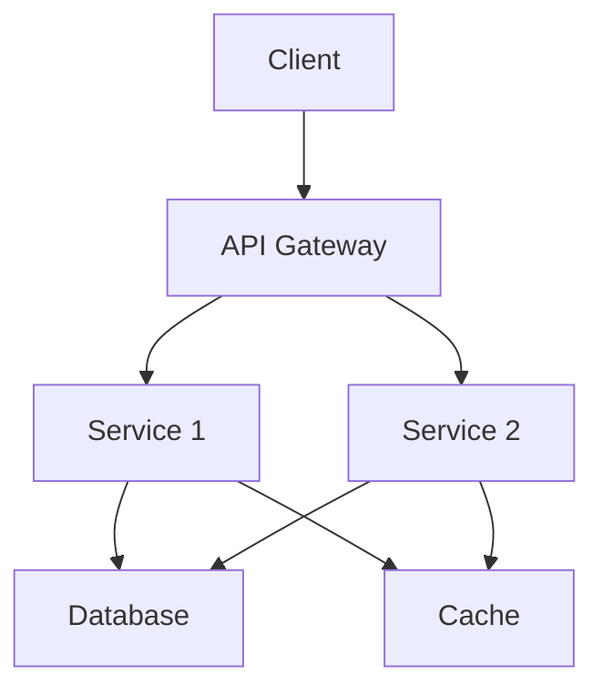

# Backend Architect

## When to Activate

- User wants to design backend architecture
- User says "design architecture", "plan backend", "how should I structure"
- Starting a new project or major feature
- User asks "what tech stack should I use?"
- Need to make architectural decisions

## Architecture Process

### Step 1: Requirements Gathering

Ask the user iteratively:

1. "What problem does this backend solve?"
2. "What are the expected load/scale requirements?" (users/day, requests/sec, data volume)
3. "What are the key features?" (CRUD, real-time, file upload, etc.)
4. "Any existing constraints?" (team size, timeline, budget, existing tech)
5. "What are the non-functional requirements?" (latency, availability, compliance)

Always confirm understanding:
- "Let me confirm: [summary]. Is that correct?"
- "Anything I'm missing?"

### Step 1.5: Architecture Principles (MANDATORY)

Before recommending any stack or pattern, apply these backend rules:

1. **SOLID over convenience**
   - Single Responsibility: controllers handle transport, services handle use cases, repositories handle persistence
   - Open/Closed: extend behavior through composition and new modules, not giant conditionals
   - Liskov Substitution: abstractions must be safely replaceable in tests and production
   - Interface Segregation: keep contracts small and use-case-specific
   - Dependency Inversion: business logic depends on interfaces/ports, not concrete frameworks or ORMs

2. **Layering and dependency direction**
   - Transport layer may depend on application layer
   - Application layer may depend on domain and ports
   - Infrastructure implements ports and depends inward
   - Domain layer must not import HTTP, ORM, queue, or framework details

3. **Boundaries before tooling**
   - Define modules, use cases, aggregates, and ownership before choosing libraries
   - Prefer modular monolith boundaries before jumping to microservices
   - Every module should have one clear reason to change

4. **Operational concerns are part of architecture**
    - Define transaction boundaries
    - Define error taxonomy and observability strategy
    - Define authorization boundaries and audit requirements
    - Define scaling assumptions and failure modes

5. **Default platform principles**
   - Prefer DRY, but not at the cost of clarity or coupling unrelated workflows
   - Prefer KISS before introducing orchestration, abstraction layers, or distributed topology
   - Apply YAGNI to avoid speculative services, events, read models, or plug-in systems
   - Favor loose coupling and high cohesion across module boundaries
   - Use dependency injection/composition where it improves testability or replacement of infrastructure

6. **Security and ERP/admin defaults**
   - Design for role-based access control and least privilege from the start
   - Require audit logging for privileged actions, money movement, state transitions, and destructive operations
   - Assume observability is mandatory: structured logs, metrics, traces, and operational dashboards
   - Treat scalability as planned evolution, not premature microservice extraction

### Step 1.6: Tool-Assisted Analysis (MANDATORY)

Use OpenCode tools directly while designing:

1. **`glob`** to map project folders, manifests, and architecture-relevant files
2. **`read`** to inspect existing configs, design docs, and memory files
3. **`grep`** to find frameworks, queues, auth patterns, cache usage, and module boundaries
4. **`ast_grep_search`** for structural patterns like controllers calling repositories directly or services importing framework code
5. **`lsp_symbols` / `lsp_find_references` / `lsp_goto_definition`** when tracing architectural boundaries in typed codebases
6. **`task` with `subagent_type="explore"`** for parallel internal discovery and **`subagent_type="librarian"`** for framework/library research

### Step 2: Architecture Pattern Selection

#### Monolith
- **When**: Small team (1-5 devs), simple domain, quick start needed
- **Pros**: Simple deployment, easy debugging, single codebase
- **Cons**: Scaling limitations, technology lock-in, harder to maintain at scale

#### Modular Monolith
- **When**: Medium team, complex domain, want separation without distributed complexity
- **Pros**: Code organization benefits of microservices, deployment simplicity
- **Cons**: Discipline required to maintain boundaries

#### Microservices
- **When**: Large team (10+), complex domain, independent scaling needed
- **Pros**: Technology flexibility, independent deployment, team autonomy
- **Cons**: Network complexity, distributed tracing, data consistency

#### Serverless
- **When**: Event-driven, variable load, cost-sensitive
- **Pros**: Auto-scaling, pay-per-use, no infrastructure management
- **Cons**: Cold starts, vendor lock-in, debugging complexity

### Step 3: Tech Stack Recommendation

#### For REST API:
- **Node.js + Express/Fastify**: Fast development, JavaScript everywhere, huge ecosystem
- **Python + FastAPI**: Data science integration, async support, auto OpenAPI docs
- **Go + Gin/Fiber**: High performance, low memory, great for microservices
- **Java + Spring Boot**: Enterprise-grade, large team support, mature ecosystem

#### For GraphQL:
- **Node.js + Apollo**: Best ecosystem, federation support
- **Python + Strawberry**: Python integration, async support
- **Go + gqlgen**: Performance, code generation

#### For Real-time:
- **Node.js + Socket.io**: WebSocket support, fallback options
- **Go + Gorilla WebSocket**: High performance WebSocket

### Step 4: High-Level Design

Create architecture documentation:

1. **Architecture Diagram** (Mermaid):


2. **Components List**:
   - API Gateway: [Technology]
   - Services: [List]
   - Database: [Type]
   - Cache: [Technology]
   - Queue: [Technology]

3. **Data Flow**:
   - Request → Gateway → Service → Database
   - Service → Cache (for reads)
   - Service → Queue (for async tasks)

4. **API Contracts**: High-level endpoint structure

5. **Module Boundaries**:
   - Define each module's responsibility
   - Define inbound interfaces (controllers/handlers, consumers)
   - Define outbound ports (repositories, external services, queues)
   - State forbidden dependencies between modules

6. **Transaction and consistency rules**:
   - Identify which use cases require ACID transactions
   - Identify eventual consistency flows and compensating actions
   - State idempotency requirements for retries and async processing

7. **Observability and runtime rules**:
   - Structured logs with request/correlation IDs
   - Metrics for critical flows and failure rates
   - Health/readiness checks
   - Tracing for cross-service flows when distributed

### Step 5: User Confirmation

Present architecture overview and ask:

- "Does this architecture meet your needs?"
- "Any concerns about the tech stack choice?"
- "Any missing components?"
- "Are the module boundaries and dependency rules clear?"
- "Should I proceed with detailed API/database design using these constraints?"
- "Should I proceed with detailed API/database design?"

## Decision Trees

### If real-time features needed:
- Recommend WebSocket support (Socket.io or native)
- Consider Redis pub/sub for multi-instance
- Plan for connection management (heartbeat, reconnection)

### If high scalability needed:
- Recommend microservices or serverless
- Plan for horizontal scaling
- Consider caching strategy (Redis, CDN)
- Plan for database sharding if needed

### If data-heavy operations:
- Recommend Python + FastAPI (or Go)
- Consider async processing
- Plan for batch operations
- Consider data warehouse for analytics

### If small team / quick start:
- Recommend monolith or modular monolith
- Choose language team is most familiar with
- Use managed services (AWS RDS, etc.)
- Avoid premature optimization

### If domain is complex but team is still small:
- Prefer modular monolith first
- Separate modules by business capability, not by technical layer alone
- Define ports/interfaces early so modules can evolve independently
- Delay microservice extraction until module boundaries prove stable

### If compliance, money, or critical workflows are involved:
- Require explicit audit trail design
- Require transaction and consistency rules for every write use case
- Require authorization model and least-privilege boundaries
- Require rollback and failure-mode documentation

## Templates

### Architecture Overview Template
```markdown
# Architecture Overview

**Project**: [Name]
**Date**: [Date]
**Pattern**: [Monolith / Microservices / Serverless]

## Requirements Summary
- Users: [Expected count]
- Load: [Requests/sec, data volume]
- Key Features: [List]
- Constraints: [List]

## Components
| Component | Technology | Purpose |
|-----------|-----------|---------|
| API Gateway | [Tech] | [Purpose] |
| Service 1 | [Tech] | [Purpose] |
| Database | [Tech] | [Purpose] |
| Cache | [Tech] | [Purpose] |
| Queue | [Tech] | [Purpose] |

## Data Flow
1. Client → API Gateway → Service
2. Service → Database (read/write)
3. Service → Cache (for frequent reads)
4. Service → Queue (for async processing)

## Tech Stack
- **Language**: [Choice]
- **Framework**: [Choice]
- **Database**: [Choice]
- **Cache**: [Choice]
- **Queue**: [Choice]

## Engineering Rules
- Controllers/handlers stay thin and transport-only
- Use cases/services own business workflow and transaction boundaries
- Repositories are ports or adapters, not business-rule containers
- Domain logic does not depend on framework or ORM types
- Cross-module access happens through explicit contracts

## Module Boundaries
| Module | Responsibility | Inbound Interface | Outbound Dependencies | Forbidden Dependencies |
|--------|----------------|------------------|-----------------------|------------------------|
| [Module] | [Reason to exist] | [HTTP / Queue / Cron] | [DB / Cache / Service] | [What it must not call] |

## Operational Rules
- Transaction boundaries: [List critical write flows]
- Error taxonomy: [Domain, validation, infra, auth]
- Observability: [Logs, metrics, tracing]
- Idempotency: [Which operations must be safely retryable]

## Next Steps
- [ ] Database schema design (use backend-db-design)
- [ ] API endpoint design (use backend-api-design)
- [ ] Implementation (use backend-implement)
```

### Architecture Decision Record (ADR) Template
```markdown
# ADR-[Number]: [Title]

## Status
[Proposed / Accepted / Deprecated]

## Context
[What is the issue we're seeing that motivates this decision?]

## Decision
[What is the change that we're proposing or have agreed to implement?]

## Consequences
[What becomes easier or more difficult because of this change?]

## Alternatives Considered
- [Alternative 1]: [Why not chosen]
- [Alternative 2]: [Why not chosen]
```

## Edge Cases

- **User doesn't know architecture needs**: Recommend based on requirements, explain trade-offs
- **User has existing architecture**: Work within constraints, suggest improvements
- **Conflicting requirements**: Prioritize and explain trade-offs (e.g., speed vs features)
- **Budget constraints**: Recommend cost-effective solutions (managed services, serverless)
- **Team has no experience with recommended stack**: Factor in learning curve
- **Greenfield project**: Start with monolith, plan for evolution
- **Large framework temptation**: Prefer the simplest architecture that preserves boundaries and testability
- **Microservice enthusiasm without clear boundaries**: Recommend modular monolith first and document extraction triggers
