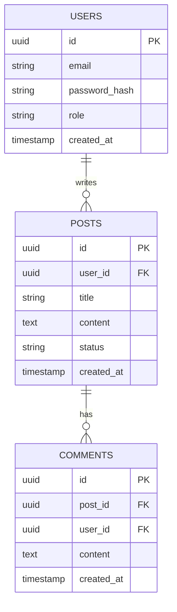
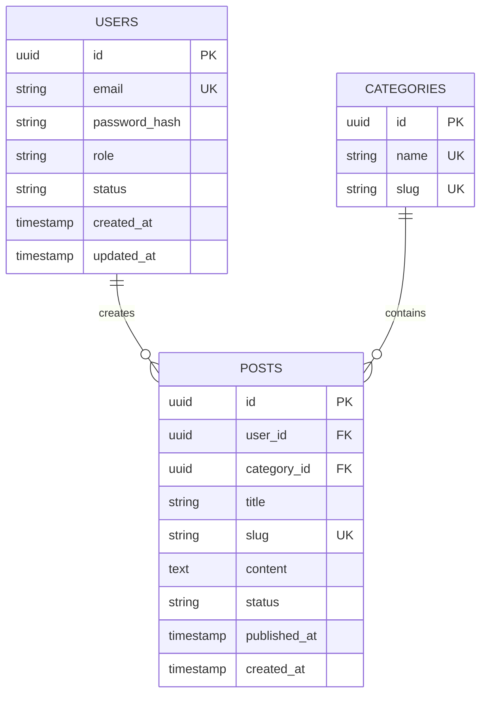

# Backend DB Design

## When to Activate

- User wants to design database schema
- User says "design database", "create schema", "plan tables"
- Starting a new feature with data storage
- Need to add new tables/collections
- User asks "what database should I use?"

## Design Process

### Step 1: Requirements Gathering

Ask the user iteratively:

1. "What data do you need to store?"
2. "What are the relationships between entities?" (1:1, 1:N, M:N)
3. "What are the access patterns?" (reads vs writes, queries needed)
4. "What are the scale requirements?" (rows, queries/sec, data size)
5. "What consistency guarantees are needed?" (ACID vs eventual)

Always confirm:
- "Let me confirm: [entity list]. Did I miss any?"

### Step 2: Database Selection

#### PostgreSQL
- **When**: Complex queries, ACID compliance, relational data, JSON columns
- **Pros**: Rich data types, JSON support, full-text search, mature
- **Cons**: More complex setup, vertical scaling primarily

#### MySQL
- **When**: Web applications, read-heavy workloads, simpler needs
- **Pros**: Fast reads, easy setup, wide support, simple replication
- **Cons**: Limited data types, less JSON support

#### MongoDB
- **When**: Flexible schema, document-oriented, rapid prototyping, hierarchical data
- **Pros**: Flexible schema, horizontal scaling, JSON-like documents
- **Cons**: No joins (use $lookup), eventual consistency, larger storage

#### Redis
- **When**: Caching, sessions, real-time features, pub/sub, queues
- **Pros**: In-memory speed, pub/sub, data structures
- **Cons**: Limited query capabilities, memory constraints, not for primary storage

### Step 3: Schema Design

#### Relational (PostgreSQL/MySQL)

For each table, define:
- Table name (snake_case, plural)
- Columns with types and constraints
- Primary key (UUID vs auto-increment)
- Foreign keys and relationships
- Indexes for query patterns
- Constraints (NOT NULL, UNIQUE, CHECK)

```sql
CREATE TABLE users (
    id UUID PRIMARY KEY DEFAULT gen_random_uuid(),
    email VARCHAR(255) UNIQUE NOT NULL,
    password_hash VARCHAR(255) NOT NULL,
    role VARCHAR(50) DEFAULT 'user',
    status VARCHAR(50) DEFAULT 'active',
    created_at TIMESTAMP DEFAULT CURRENT_TIMESTAMP,
    updated_at TIMESTAMP DEFAULT CURRENT_TIMESTAMP
);

CREATE INDEX idx_users_email ON users(email);
CREATE INDEX idx_users_status ON users(status);
```

#### Document (MongoDB)

For each collection, define:
- Collection name (plural, camelCase)
- Document structure
- Validation rules
- Indexes

```javascript
{
    _id: ObjectId,
    email: String,
    passwordHash: String,
    role: String,
    status: String,
    createdAt: Date,
    updatedAt: Date
}

db.users.createIndex({ email: 1 }, { unique: true })
db.users.createIndex({ status: 1 })
```

### Step 4: ERD Generation

Create mermaid ERD diagram:



### Step 5: Migration Planning

For each schema change:

1. **Create migration file** with timestamp prefix
2. **Define up and down** migrations
3. **Plan data migration** if changing existing data
4. **Test migration** on staging
5. **Plan rollback** strategy

Example migration structure:
```
migrations/
├── 20260613_001_create_users.sql
├── 20260613_002_create_posts.sql
├── 20260613_003_add_user_role.sql
```

### Step 6: User Confirmation

Present schema design:

- Show ERD diagram
- List all tables/collections with key fields
- Highlight important indexes
- Explain normalization decisions
- Show migration plan

Ask:
- "Does this schema meet your needs?"
- "Any missing fields or relationships?"
- "Any normalization concerns?"
- "Should I save this to db-schema.md memory?"

## Decision Trees

### If user data needed:
- `users` table with: id, email, password_hash, role, status
- Add timestamps: created_at, updated_at
- Index email (unique) and status
- Consider soft delete (deleted_at)

### If content management needed:
- `posts/articles` table
- `categories` and `tags` tables (M:N relationship)
- Status field: draft, published, archived
- Slug field for URLs
- Author relationship to users

### If e-commerce needed:
- `products`, `orders`, `order_items`
- `customers`, `addresses`
- `payments`, `inventory`
- Money: use decimal type, never float
- Order status: pending, paid, shipped, delivered, cancelled

### If real-time features needed:
- Consider Redis for sessions
- WebSocket connections table
- Message history collection
- Read receipts and typing indicators

### If audit trail needed:
- `audit_log` table
- Columns: entity_type, entity_id, action, user_id, old_value, new_value, timestamp
- Consider append-only storage

## Templates

### PostgreSQL Schema Template
```sql
-- Users table
CREATE TABLE users (
    id UUID PRIMARY KEY DEFAULT gen_random_uuid(),
    email VARCHAR(255) UNIQUE NOT NULL,
    password_hash VARCHAR(255) NOT NULL,
    role VARCHAR(50) DEFAULT 'user' CHECK (role IN ('user', 'admin', 'moderator')),
    status VARCHAR(50) DEFAULT 'active' CHECK (status IN ('active', 'suspended', 'deleted')),
    created_at TIMESTAMP DEFAULT CURRENT_TIMESTAMP,
    updated_at TIMESTAMP DEFAULT CURRENT_TIMESTAMP,
    deleted_at TIMESTAMP NULL
);

-- Indexes
CREATE INDEX idx_users_email ON users(email);
CREATE INDEX idx_users_status ON users(status) WHERE deleted_at IS NULL;
CREATE INDEX idx_users_created_at ON users(created_at DESC);
```

### MongoDB Schema Template
```javascript
// Users collection
{
    _id: ObjectId,
    email: String, // unique, indexed
    passwordHash: String,
    role: { type: String, enum: ['user', 'admin', 'moderator'], default: 'user' },
    status: { type: String, enum: ['active', 'suspended', 'deleted'], default: 'active' },
    createdAt: { type: Date, default: Date.now },
    updatedAt: { type: Date, default: Date.now },
    deletedAt: { type: Date, default: null }
}

// Indexes
db.users.createIndex({ email: 1 }, { unique: true })
db.users.createIndex({ status: 1, createdAt: -1 })
db.users.createIndex({ deletedAt: 1 }, { sparse: true })
```

### ERD Template


## Edge Cases

- **No clear data model**: Ask user for examples, start with core entities
- **Complex relationships**: Use junction tables for M:N, consider denormalization for performance
- **High write load**: Consider write optimization (batching, async, partitioning)
- **High read load**: Consider read replicas, caching, denormalization
- **Time-series data**: Consider TimescaleDB, InfluxDB
- **Search-heavy**: Consider Elasticsearch, Meilisearch alongside primary DB
- **Multi-tenant**: Add tenant_id to all tables, consider schema-per-tenant
