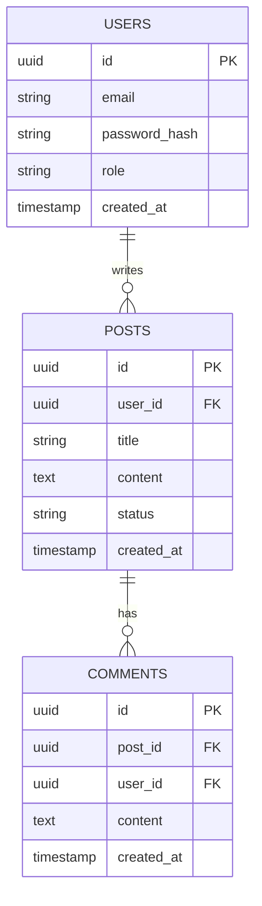
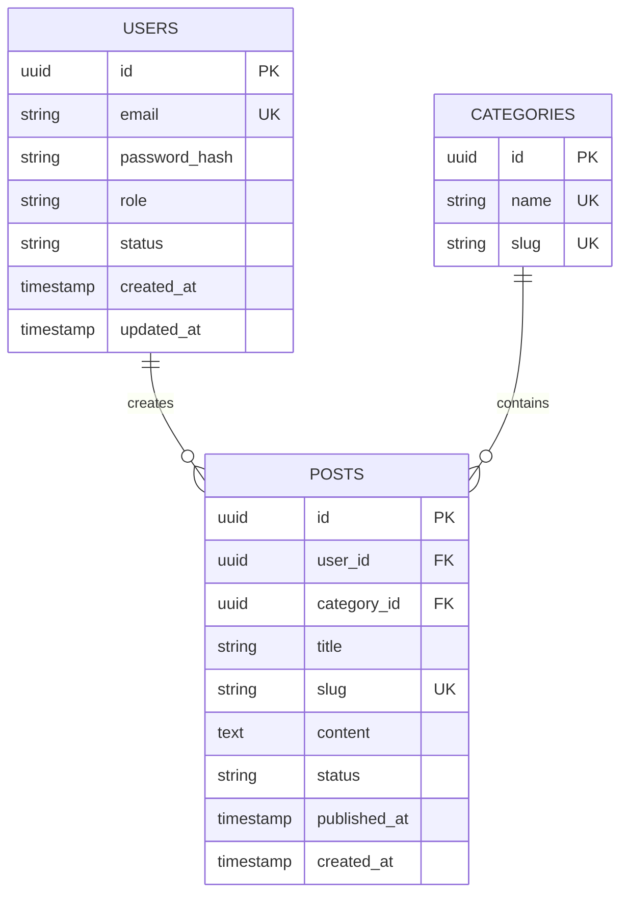

# Backend DB Design

## When to Activate

- User wants to design database schema
- User says "design database", "create schema", "plan tables"
- Starting a new feature with data storage
- Need to add new tables/collections
- User asks "what database should I use?"

## Prerequisites

- REQUIRED: project root confirmed and readable
  - Check: `bash -c 'test -d src || test -d app || test -d internal || test -d lib'`
  - If missing: stop and ask the user for the correct project path
- REQUIRED: `_shared/principles.md` loaded
  - Check: `read .agents/skills/_shared/principles.md | head -1`
  - If missing: stop and ask the user to confirm the install location of the shared references
- REQUIRED: data storage need is confirmed
  - Check: ask the user "What data do you need to store?" and confirm at least one entity is identified
  - If missing: stop and ask the user to confirm the data storage need and at least one entity
- RECOMMENDED: `.opencode/everything-backend-memory/tech-stack.md` exists and is non-empty
  - Check: `glob .opencode/everything-backend-memory/tech-stack.md`
  - If missing: run `backend-scan` to populate memory, or proceed with project-only context if the user confirms
- RECOMMENDED: `.opencode/everything-backend-memory/project-overview.md` exists
  - Check: `glob .opencode/everything-backend-memory/project-overview.md`
  - If missing: run `backend-scan` to populate memory, or proceed with project-only context if the user confirms
- RECOMMENDED: `db-schema.md` exists
  - Check: `glob .opencode/everything-backend-memory/db-schema.md`
  - If missing: create an empty `db-schema.md` and append the new schema after this design is approved
- If any REQUIRED Check fails, run `backend-scan` with `mode=auto`, then re-run these checks. If the missing file is a project file (e.g., manifest, source dir) that `backend-scan` cannot create, stop and ask the user.

## Required Context (load in order; stop if context budget is tight)

1. REQUIRED: `_shared/principles.md` → only Code/Architecture, API, System, Security sections
2. REQUIRED: `tech-stack.md` (small, essential)
3. REQUIRED: `project-overview.md`
4. OPTIONAL: `db-schema.md` (only if touching data layer)
5. OPTIONAL: `api-patterns.md` (only if designing endpoints)
6. OPTIONAL: `decisions.md` (only if prior decisions matter)
7. SKIP: `issues.md` unless reviewing risks

## Design Process

### Step 0: Context Loading

Before gathering requirements, read project memory for existing context:

- `project-overview.md` — project type and module boundaries
- `tech-stack.md` — languages, frameworks, databases, ORM
- `db-schema.md` — current database schema
- `decisions.md` — prior schema or architecture decisions

If memory is stale or empty, suggest running `backend-scan` first.

### Step 1: Requirements Gathering

Ask the user iteratively:

1. "What data do you need to store?"
2. "What are the relationships between entities?" (1:1, 1:N, M:N)
3. "What are the access patterns?" (reads vs writes, queries needed)
4. "What are the scale requirements?" (rows, queries/sec, data size)
5. "What consistency guarantees are needed?" (ACID vs eventual)

Always confirm:
- "Let me confirm: [entity list]. Did I miss any?"

### Step 1.5: Data Modeling Rules (MANDATORY)

Default to relational discipline unless the access pattern clearly requires otherwise. Apply the database principles in `_shared/principles.md` before finalizing a schema.

### Step 1.6: Tool-Assisted Schema Analysis (MANDATORY)

Use OpenCode tools directly while designing or reviewing schema work.

See `_shared/tool-rules.md` for the canonical tool-usage rules.

### Step 2: Database Selection

#### PostgreSQL
- **When**: Complex queries, ACID compliance, relational data, JSON columns
- **Pros**: Rich data types, JSON support, full-text search, mature
- **Cons**: More complex setup, vertical scaling primarily

#### MySQL
- **When**: Web applications, read-heavy workloads, simpler needs
- **Pros**: Fast reads, easy setup, wide support, simple replication
- **Cons**: Limited data types, less JSON support

#### MongoDB
- **When**: Flexible schema, document-oriented, rapid prototyping, hierarchical data
- **Pros**: Flexible schema, horizontal scaling, JSON-like documents
- **Cons**: No joins (use $lookup), eventual consistency, larger storage

#### Redis
- **When**: Caching, sessions, real-time features, pub/sub, queues
- **Pros**: In-memory speed, pub/sub, data structures
- **Cons**: Limited query capabilities, memory constraints, not for primary storage

### Step 3: Schema Design

#### Relational (PostgreSQL/MySQL)

For each table, define:
- Table name (snake_case, plural)
- Columns with types and constraints
- Primary key (UUID vs auto-increment)
- Foreign keys and relationships
- Indexes for query patterns
- Constraints (NOT NULL, UNIQUE, CHECK)
- Candidate keys and business keys
- Delete/update behavior on foreign keys
- Whether the table is in 3NF and why

Before finalizing a relational schema, perform this normalization check:

1. Is every column atomic?
2. Does every non-key column depend on the whole key?
3. Does any non-key column depend on another non-key column?
4. Are derived/summary fields stored unnecessarily?
5. Are lookup/reference tables needed?
6. Are many-to-many relationships resolved through junction tables?

```sql
CREATE TABLE users (
    id UUID PRIMARY KEY DEFAULT gen_random_uuid(),
    email VARCHAR(255) UNIQUE NOT NULL,
    password_hash VARCHAR(255) NOT NULL,
    role VARCHAR(50) DEFAULT 'user',
    status VARCHAR(50) DEFAULT 'active',
    created_at TIMESTAMP DEFAULT CURRENT_TIMESTAMP,
    updated_at TIMESTAMP DEFAULT CURRENT_TIMESTAMP
);

CREATE INDEX idx_users_email ON users(email);
CREATE INDEX idx_users_status ON users(status);
```

#### Document (MongoDB)

For each collection, define:
- Collection name (plural, camelCase)
- Document structure
- Validation rules
- Indexes

```javascript
{
    _id: ObjectId,
    email: String,
    passwordHash: String,
    role: String,
    status: String,
    createdAt: Date,
    updatedAt: Date
}

db.users.createIndex({ email: 1 }, { unique: true })
db.users.createIndex({ status: 1 })
```

### Step 4: ERD Generation

Create mermaid ERD diagram:



### Step 5: Migration Planning

For each schema change:

1. **Create migration file** with timestamp prefix
2. **Define up and down** migrations
3. **Plan data migration** if changing existing data
4. **Test migration** on staging
5. **Plan rollback** strategy

### Step 5.5: Transaction and Constraint Design

For each write-heavy or critical workflow, define:

1. **Transaction boundary**
   - Which statements must succeed or fail together?
   - Which side effects must happen outside the transaction?

2. **Concurrency strategy**
   - Optimistic locking, pessimistic locking, unique constraint enforcement, or idempotency key

3. **Constraint strategy**
   - Which rules are enforced by DB constraints?
   - Which rules stay in application logic because they span multiple aggregates/tables?

4. **Denormalization policy**
   - If storing duplicated or computed data, document why and how it stays correct

Example migration structure:
```
migrations/
├── 20260613_001_create_users.sql
├── 20260613_002_create_posts.sql
├── 20260613_003_add_user_role.sql
```

### Step 6: User Confirmation

Present schema design:

- Show ERD diagram
- List all tables/collections with key fields
- Highlight important indexes
- Explain normalization decisions
- Explain candidate keys, foreign keys, and delete/update behavior
- Explain transaction boundaries for critical write flows
- Show migration plan

Ask:
- "Does this schema meet your needs?"
- "Any missing fields or relationships?"
- "Any normalization concerns?"
- "Should any denormalization be justified for performance, or should we keep strict 3NF?"
- "Should I save this to db-schema.md memory?"

## Decision Trees

### If user data needed:
- `users` table with: id, email, password_hash, role, status
- Add timestamps: created_at, updated_at
- Index email (unique) and status
- Consider soft delete (deleted_at)

### If content management needed:
- `posts/articles` table
- `categories` and `tags` tables (M:N relationship)
- Status field: draft, published, archived
- Slug field for URLs
- Author relationship to users

### If e-commerce needed:
- `products`, `orders`, `order_items`
- `customers`, `addresses`
- `payments`, `inventory`
- Money: use decimal type, never float
- Order status: pending, paid, shipped, delivered, cancelled
- Require transaction boundaries for checkout, payment capture, and inventory reservation

### If real-time features needed:
- Consider Redis for sessions
- WebSocket connections table
- Message history collection
- Read receipts and typing indicators

### If audit trail needed:
- `audit_log` table
- Columns: entity_type, entity_id, action, user_id, old_value, new_value, timestamp
- Consider append-only storage

## Templates

### PostgreSQL Schema Template
```sql
-- Users table
CREATE TABLE users (
    id UUID PRIMARY KEY DEFAULT gen_random_uuid(),
    email VARCHAR(255) UNIQUE NOT NULL,
    password_hash VARCHAR(255) NOT NULL,
    role VARCHAR(50) DEFAULT 'user' CHECK (role IN ('user', 'admin', 'moderator')),
    status VARCHAR(50) DEFAULT 'active' CHECK (status IN ('active', 'suspended', 'deleted')),
    created_at TIMESTAMP DEFAULT CURRENT_TIMESTAMP,
    updated_at TIMESTAMP DEFAULT CURRENT_TIMESTAMP,
    deleted_at TIMESTAMP NULL
);

-- Indexes
CREATE INDEX idx_users_email ON users(email);
CREATE INDEX idx_users_status ON users(status) WHERE deleted_at IS NULL;
CREATE INDEX idx_users_created_at ON users(created_at DESC);
```

### Normalization Review Template
```markdown
## Normalization Review

### 1NF
- [ ] No repeating groups or multi-value columns
- [ ] Atomic column values only

### 2NF
- [ ] No partial dependency on part of a composite key
- [ ] Junction tables contain only relationship-specific attributes

### 3NF
- [ ] No non-key column depends on another non-key column
- [ ] Lookup/reference data extracted where appropriate
- [ ] Derived data is not stored unless explicitly justified

### Denormalization Exceptions
- [ ] Any duplicated/computed data is documented
- [ ] Refresh/consistency mechanism is defined
```

### Index Design Template
```markdown
## Index Strategy

| Query Pattern | Columns Filtered/Sorted | Proposed Index | Why This Order |
|---------------|--------------------------|----------------|----------------|
| [Example] | [status, created_at] | `(status, created_at DESC)` | [Equality before range/sort] |

Rules:
- Index columns that appear in high-value filters, joins, uniqueness checks, and sort clauses
- Prefer composite indexes that match real query order
- Do not add speculative indexes without a read pattern
- Revisit index cost for high-write tables
```

### MongoDB Schema Template
```javascript
// Users collection
{
    _id: ObjectId,
    email: String, // unique, indexed
    passwordHash: String,
    role: { type: String, enum: ['user', 'admin', 'moderator'], default: 'user' },
    status: { type: String, enum: ['active', 'suspended', 'deleted'], default: 'active' },
    createdAt: { type: Date, default: Date.now },
    updatedAt: { type: Date, default: Date.now },
    deletedAt: { type: Date, default: null }
}

// Indexes
db.users.createIndex({ email: 1 }, { unique: true })
db.users.createIndex({ status: 1, createdAt: -1 })
db.users.createIndex({ deletedAt: 1 }, { sparse: true })
```

### ERD Template


## Edge Cases

- **No clear data model**: Ask user for examples, start with core entities
- **Complex relationships**: Use junction tables for M:N, consider denormalization for performance
- **High write load**: Consider write optimization (batching, async, partitioning)
- **High read load**: Consider read replicas, caching, denormalization
- **Time-series data**: Consider TimescaleDB, InfluxDB
- **Search-heavy**: Consider Elasticsearch, Meilisearch alongside primary DB
- **Multi-tenant**: Add tenant_id to all tables, consider schema-per-tenant
- **Premature denormalization**: Keep 3NF until measurement proves a bottleneck
- **Cross-table business rule**: Enforce local invariants in DB constraints and cross-aggregate rules in application transactions
