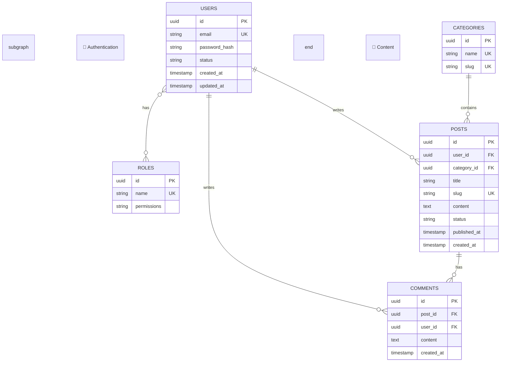
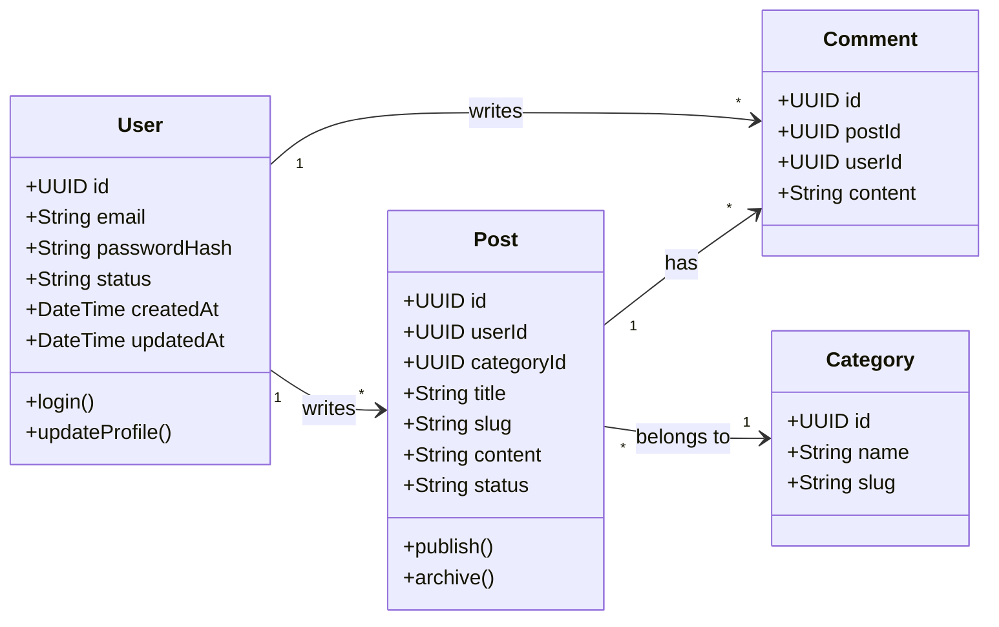
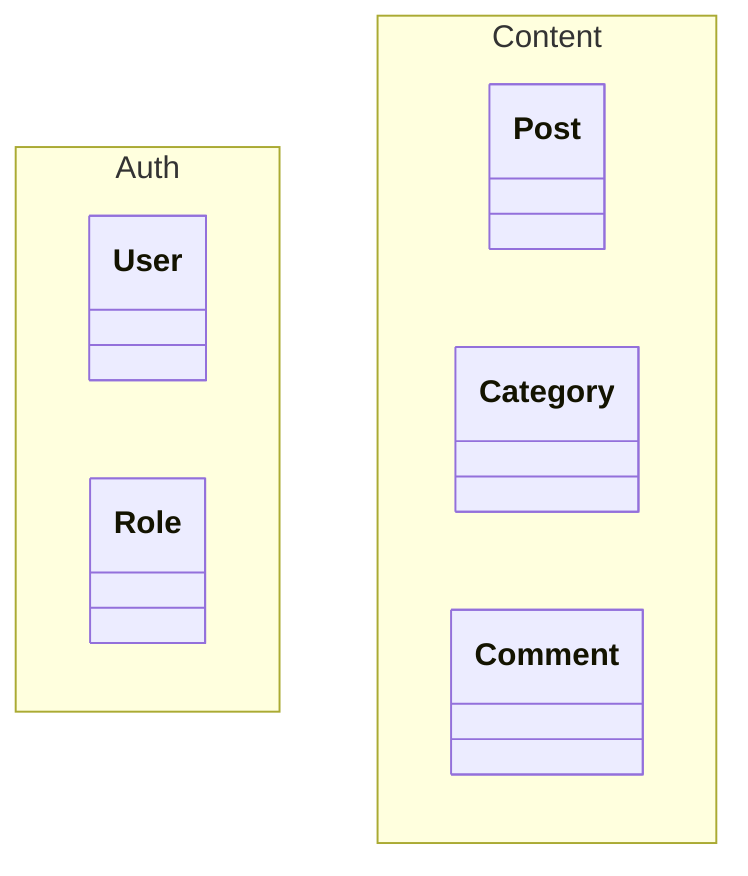
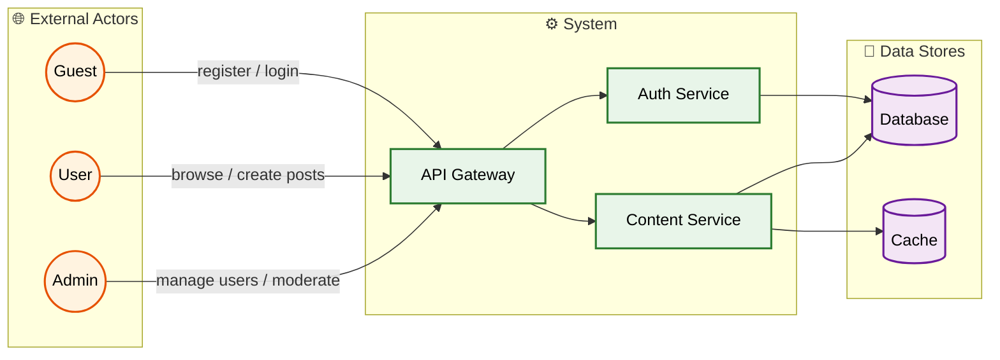
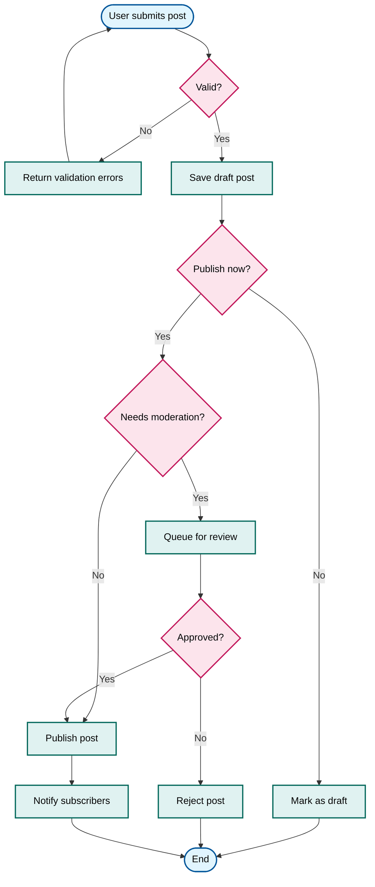
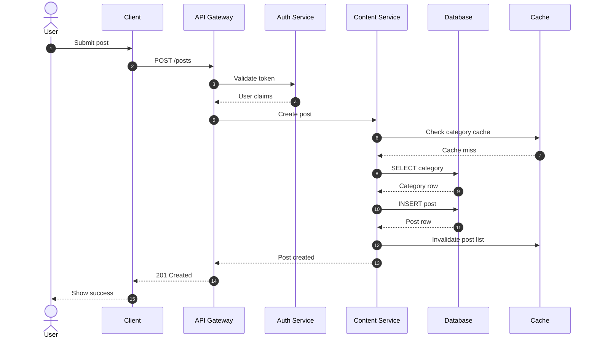
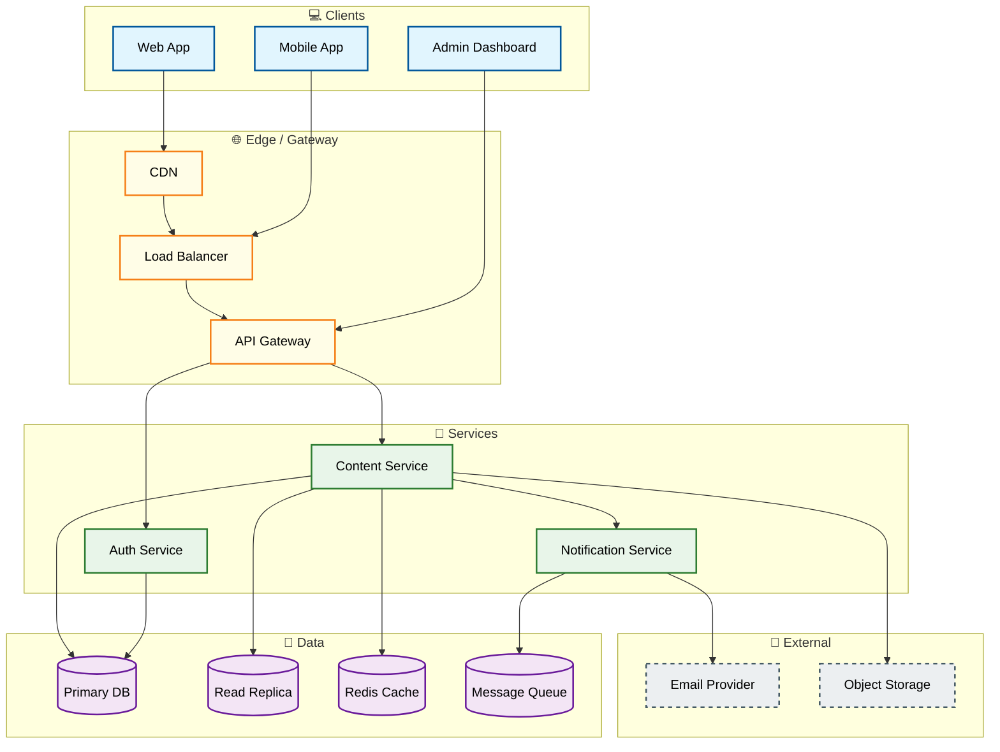

# Backend Visualize

## When to Activate

- User says "visualize database", "draw ERD", "create class diagram"
- User says "diagram schema", "show me the database", "make it visual"
- User wants a visual representation of backend/data structure
- User wants user flows, actor diagrams, or system architecture diagrams
- After `backend-db-design` or `backend-architect` to produce diagrams

## Visualization Process

### Step 0: Context Loading

Before asking for input, read project memory for existing context:

- `project-overview.md` — project type and module boundaries
- `tech-stack.md` — languages, frameworks, databases, ORM
- `db-schema.md` — current database schema
- `api-patterns.md` — existing API conventions
- `decisions.md` — prior visual or architecture decisions

If memory is stale or empty, suggest running `backend-scan` first.

### Step 1: Ask the User What to Visualize

Always present the menu and let the user pick. Do not guess.

```markdown
I can generate several types of diagrams for you. Which one would you like?

1. **ERD** — Entity-Relationship Diagram of your database schema
2. **Class Diagram** — OOP/class structure from models or domain entities
3. **User / Actor Diagram** — Who uses the system and what they can do
4. **Flowchart** — Business process or data flow
5. **Sequence Diagram** — How components/actors interact over time
6. **Architecture Diagram** — High-level system components and connections
7. **All of the above** — Generate every diagram type that fits the input

What would you like to see? (You can pick a number or type the name.)
```

If the user says "all" or picks multiple, generate each requested diagram in the same response, separated by clear headings.

### Step 2: Discover the Input Source

Ask how the diagram should be sourced. Accept any of these:

1. **Database schema dump / SQL DDL** — Paste or point to `.sql` files
2. **ORM model files** — Prisma, TypeORM, Sequelize, Drizzle, SQLAlchemy, etc.
3. **Migration files** — Ordered schema change files
4. **Existing memory** — Use `db-schema.md` or `project-overview.md`
5. **User description** — The user describes entities/relationships in plain text
6. **Auto-detect** — Scan the project and infer the best source

If the user does not specify, default to **auto-detect** by reading the project structure and memory files.

Use OpenCode tools to read files, run grep, or scan the project. See `_shared/tool-rules.md` for canonical tool-usage rules.

### Step 3: Theme and Grouping Rules

Every diagram MUST use a consistent theme and clear grouping.

#### Color Theme (Mermaid classDefs)

Apply these class definitions to all diagrams. Use them consistently:

```mermaid
classDef entity fill:#e1f5fe,stroke:#01579b,stroke-width:2px,color:#000;
classDef actor fill:#fff3e0,stroke:#e65100,stroke-width:2px,color:#000;
classDef service fill:#e8f5e9,stroke:#2e7d32,stroke-width:2px,color:#000;
classDef database fill:#f3e5f5,stroke:#6a1b9a,stroke-width:2px,color:#000;
classDef external fill:#eceff1,stroke:#455a64,stroke-width:2px,stroke-dasharray: 5 5,color:#000;
classDef boundary fill:#fffde7,stroke:#f57f17,stroke-width:2px,color:#000;
classDef process fill:#e0f2f1,stroke:#00695c,stroke-width:2px,color:#000;
classDef decision fill:#fce4ec,stroke:#c2185b,stroke-width:2px,color:#000;
```

Use the same color meaning across every diagram type:

| Color | Meaning |
|-------|---------|
| Blue (`entity`) | Tables, entities, domain models |
| Orange (`actor`) | Users, actors, roles |
| Green (`service`) | Services, modules, controllers |
| Purple (`database`) | Databases, stores, repositories |
| Grey dashed (`external`) | External APIs, third parties |
| Yellow (`boundary`) | Subsystems, bounded contexts, groups |
| Teal (`process`) | Process steps, use cases |
| Pink (`decision`) | Decision points |

#### Grouping Rules

- Use `subgraph` blocks to group related entities/services/actors.
- Give each subgraph a descriptive label in **Title Case**.
- Keep each subgraph to 3–7 items when possible.
- Add a one-line comment above each group explaining what belongs together.
- If a diagram has more than ~12 nodes, split it into multiple subgraphs or offer to split into multiple diagrams.

### Step 4: Generate the Diagram

Choose the right Mermaid syntax for the selected diagram type. Follow the templates below exactly.

---

## Diagram Templates

### 1. ERD (Entity-Relationship Diagram)

Use `erDiagram` syntax.



ERD rules:
- Use `PK`, `FK`, `UK` annotations.
- Group entities by bounded context in subgraphs.
- Show cardinalities explicitly (`||--o{`, `}o--o{`, etc.).
- Keep relationship labels short and verb-based.

---

### 2. Class Diagram

Use `classDiagram` syntax.



Class diagram rules:
- Group related classes in `namespace` blocks.
- Show visibility (`+`, `-`, `#`) for public/private/protected members.
- Label associations with cardinality and role.
- Color classes by type using `classDef` from the theme.

Example with namespaces:



---

### 3. User / Actor Diagram

Use `graph LR` or `graph TD` with actor nodes.



User/actor diagram rules:
- Use `((Actor))` or `[Role]` shapes for users.
- Show what each actor can do with labeled arrows.
- Group by external actors, system, and data stores.
- Use the actor color for all user/role nodes.

---

### 4. Flowchart

Use `graph TD` or `graph LR` syntax.



Flowchart rules:
- Use `([Start/End])` for terminal nodes.
- Use `{Decision}` for decision diamonds.
- Label every outgoing arrow with the condition/trigger.
- Keep the happy path left-to-right or top-to-bottom.

---

### 5. Sequence Diagram

Use `sequenceDiagram` syntax.



Sequence diagram rules:
- Use `actor` for human participants.
- Use short, descriptive participant aliases.
- Number important steps with `autonumber`.
- Group related interactions visually with `rect` blocks if needed.
- Show synchronous calls as solid arrows, returns as dashed.

---

### 6. Architecture Diagram

Use `graph TD` or `graph LR` syntax.



Architecture diagram rules:
- Group by logical layers (Clients, Edge, Services, Data, External).
- Show directional data flow with arrows.
- Use dashed borders for external/third-party components.
- Label critical connections if the relationship is not obvious.

---

## Output Format

For each generated diagram, produce:

1. **Heading** with the diagram type
2. **One-line summary** of what the diagram shows
3. **Mermaid code block** ( fenced with ` ```mermaid ` )
4. **Legend** explaining colors and shapes
5. **Notes** highlighting important relationships, assumptions, or missing data

Example:

```markdown
## ERD — Blog Platform

This diagram shows the core entities and relationships for the blog domain.

```mermaid
...diagram...
```

**Legend:**
- Blue boxes = database entities
- Orange circles = users/actors
- Purple cylinders = data stores
- Solid lines = relationships with cardinality

**Notes:**
- Soft delete is implemented via `deleted_at` on USERS and POSTS.
- Many-to-many between USERS and ROLES is resolved by a junction table.
```

---

## Handling Multiple Diagrams

If the user requests "all" diagrams, generate them in this order:

1. Architecture Diagram (system context)
2. User / Actor Diagram (who uses it)
3. ERD (data model)
4. Class Diagram (if object/model view adds value)
5. Flowchart (if a key business process is known)
6. Sequence Diagram (if a key interaction is known)

For each diagram, explain briefly why it is useful. Do not overwhelm the user; if the schema is large, offer to split into focused diagrams by bounded context.

---

## Edge Cases

- **No schema available**: Ask the user to describe the core entities and relationships, then generate a diagram from the description.
- **Very large schema**: Split into multiple ERDs by subgraph/bounded context. Offer to generate per-context diagrams.
- **Ambiguous relationships**: Ask the user to confirm cardinality and optionality before drawing.
- **No ORM / no migrations**: Fall back to SQL DDL or plain-text description.
- **User picks diagram before providing input**: Ask for the input source first, then generate.
- **Mermaid rendering issues**: Simplify the diagram, reduce node count, or split subgraphs. Avoid deeply nested subgraphs.
- **Conflicting visual conventions**: Always prefer this skill's theme. If the project has existing diagrams, match their style after confirming with the user.
- **Diagram becomes too wide**: Switch direction from `LR` to `TD`, or split into linked diagrams.

---

## Saving Output

Ask the user after generation:

> "Would you like me to save these diagrams to a file (e.g., `docs/diagrams.md`) or update project memory?"

If yes, write the diagrams to a Markdown file under `docs/` or the project's preferred documentation path.
