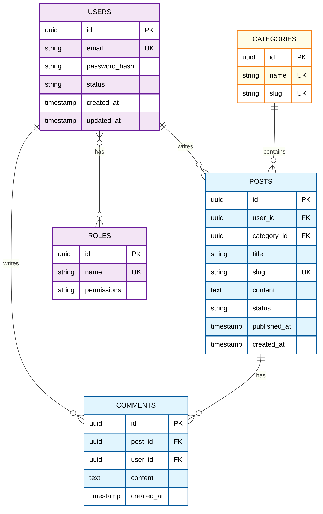
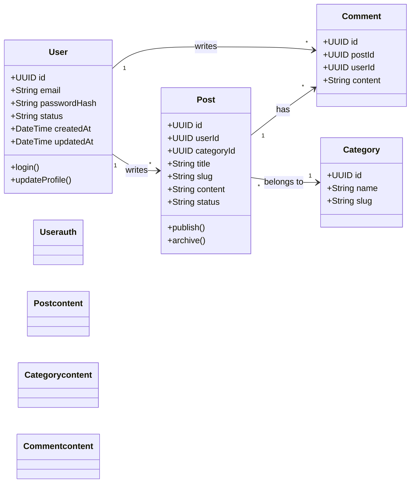
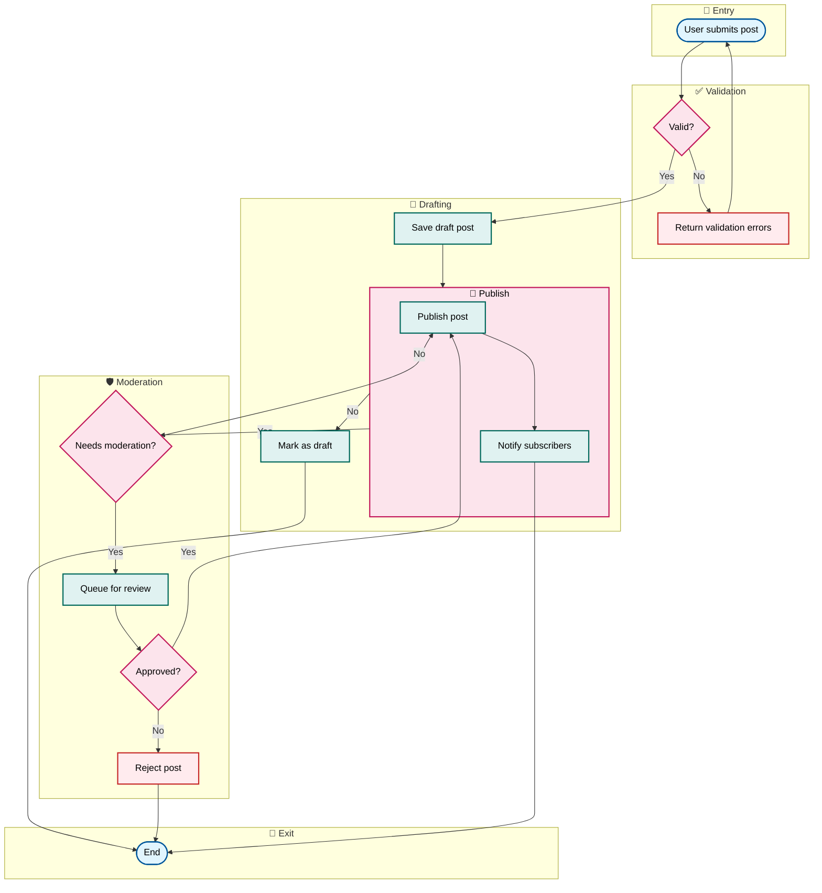
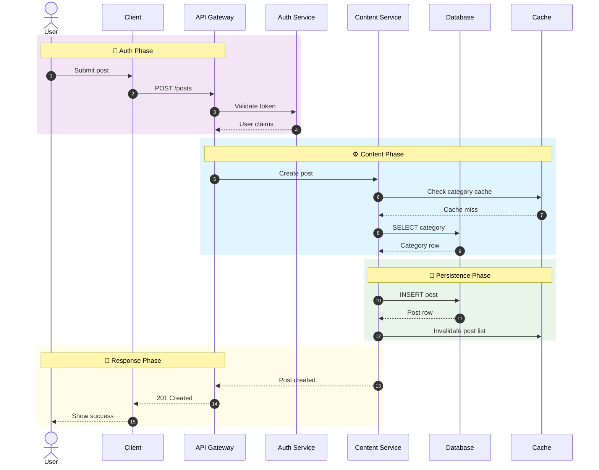
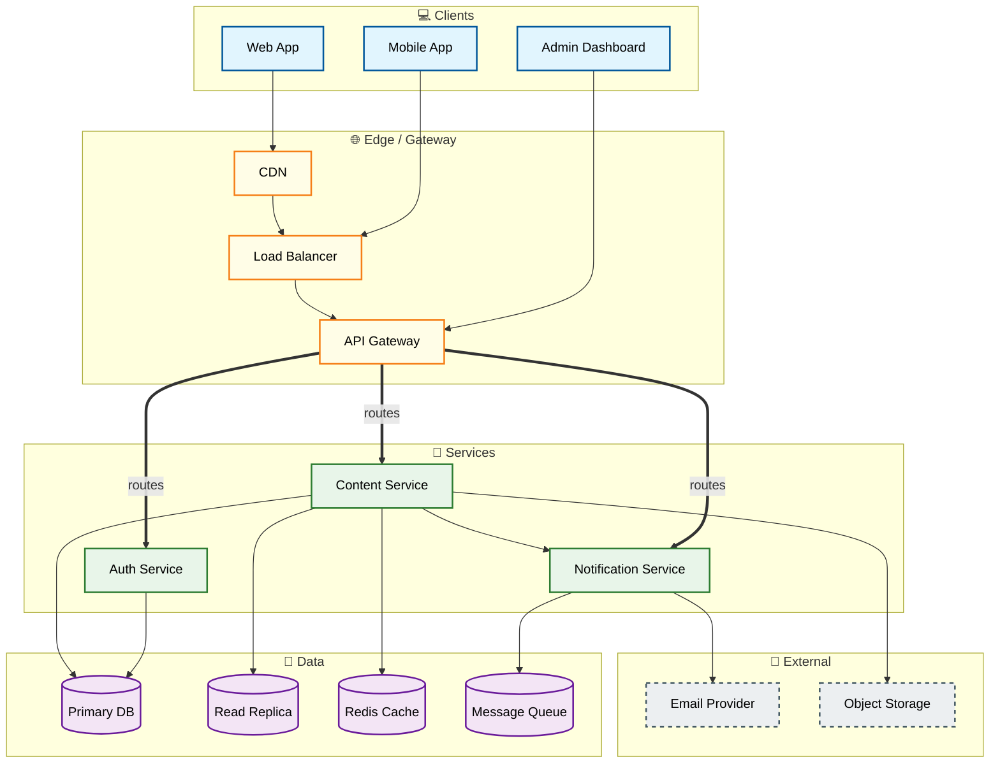

# Backend Visualize

## When to Activate

- User says "visualize database", "draw ERD", "create class diagram"
- User says "diagram schema", "show me the database", "make it visual"
- User wants a visual representation of backend/data structure
- User wants user flows, actor diagrams, or system architecture diagrams
- After `backend-db-design` or `backend-architect` to produce diagrams

## Visualization Process

### Step 0: Context Loading

Before asking for input, read project memory for existing context:

- `project-overview.md` — project type and module boundaries
- `tech-stack.md` — languages, frameworks, databases, ORM
- `db-schema.md` — current database schema
- `api-patterns.md` — existing API conventions
- `decisions.md` — prior visual or architecture decisions

If memory is stale or empty, suggest running `backend-scan` first.

### Step 1: Ask the User What to Visualize

Always present the menu and let the user pick. Do not guess.

```markdown
I can generate several types of diagrams for you. Which one would you like?

1. **ERD** — Entity-Relationship Diagram of your database schema
2. **Class Diagram** — OOP/class structure from models or domain entities
3. **User / Actor Diagram** — Who uses the system and what they can do
4. **Flowchart** — Business process or data flow
5. **Sequence Diagram** — How components/actors interact over time
6. **Architecture Diagram** — High-level system components and connections
7. **All of the above** — Generate every diagram type that fits the input

What would you like to see? (You can pick a number or type the name.)
```

If the user says "all" or picks multiple, generate each requested diagram in the same response, separated by clear headings.

### Step 2: Discover the Input Source

Ask how the diagram should be sourced. Accept any of these:

1. **Database schema dump / SQL DDL** — Paste or point to `.sql` files
2. **ORM model files** — Prisma, TypeORM, Sequelize, Drizzle, SQLAlchemy, etc.
3. **Migration files** — Ordered schema change files
4. **Existing memory** — Use `db-schema.md` or `project-overview.md`
5. **User description** — The user describes entities/relationships in plain text
6. **Auto-detect** — Scan the project and infer the best source

If the user does not specify, default to **auto-detect** by reading the project structure and memory files.

Use OpenCode tools to read files, run grep, or scan the project. See `_shared/tool-rules.md` for canonical tool-usage rules.

### Step 3: Theme and Grouping Rules

Every diagram MUST use a consistent theme and clear grouping.

#### Color Theme (Mermaid classDefs)

Apply these class definitions to all diagrams. Use them consistently:

```mermaid
classDef entity fill:#e1f5fe,stroke:#01579b,stroke-width:2px,color:#000;
classDef actor fill:#fff3e0,stroke:#e65100,stroke-width:2px,color:#000;
classDef service fill:#e8f5e9,stroke:#2e7d32,stroke-width:2px,color:#000;
classDef database fill:#f3e5f5,stroke:#6a1b9a,stroke-width:2px,color:#000;
classDef external fill:#eceff1,stroke:#455a64,stroke-width:2px,stroke-dasharray: 5 5,color:#000;
classDef boundary fill:#fffde7,stroke:#f57f17,stroke-width:2px,color:#000;
classDef process fill:#e0f2f1,stroke:#00695c,stroke-width:2px,color:#000;
classDef decision fill:#fce4ec,stroke:#c2185b,stroke-width:2px,color:#000;
```

Use the same color meaning across every diagram type:

| Color | Meaning |
|-------|---------|
| Blue (`entity`) | Tables, entities, domain models |
| Orange (`actor`) | Users, actors, roles |
| Green (`service`) | Services, modules, controllers |
| Purple (`database`) | Databases, stores, repositories |
| Grey dashed (`external`) | External APIs, third parties |
| Yellow (`boundary`) | Subsystems, bounded contexts, groups |
| Teal (`process`) | Process steps, use cases |
| Pink (`decision`) | Decision points |

#### Grouping Rules

- Use `subgraph` blocks to group related entities/services/actors.
- Give each subgraph a descriptive label in **Title Case**.
- Keep each subgraph to 3–7 items when possible.
- Add a one-line comment above each group explaining what belongs together.
- If a diagram has more than ~12 nodes, split it into multiple subgraphs or offer to split into multiple diagrams.

### Step 4: Generate the Diagram

Choose the right Mermaid syntax for the selected diagram type. Follow the templates below exactly.

---

## Diagram Templates

### 1. ERD (Entity-Relationship Diagram)

Use `erDiagram` syntax. Note: `erDiagram` does **not** support `subgraph` blocks — use color-coded `classDef` and `class` assignments to group entities by bounded context instead.



ERD rules:
- **Do not use `subgraph` in `erDiagram`** — Mermaid silently fails to parse them, leaking the directive text into the output. Group entities with `%% 🔐 Authentication` comment headers + matching `classDef`/`class` assignments instead.
- Use `PK`, `FK`, `UK` annotations on every relevant column.
- **`erDiagram` does NOT use semicolons** after `classDef` or `class` statements. Using `;` causes a parse error. Write:
  ```mermaid
  classDef auth fill:#f3e5f5,stroke:#6a1b9a,stroke-width:2px,color:#000
  class USERS,ROLES auth
  ```
- **Per-group classDefs** named by semantic role (`auth`, `content`, `boundary`) and applied via a single `class A,B,C <name>` line per group. `erDiagram` supports the comma-separated multi-node form here.
- Show cardinalities explicitly (`||--o{`, `}o--o{`, etc.).
- Keep relationship labels short and verb-based.
- For fan-out relationships (one source → many targets), write each relationship on its own line — `erDiagram` does **not** support the `&` chaining operator. Example:
  ```mermaid
  USERS ||--o{ POSTS : writes
  USERS ||--o{ COMMENTS : writes
  USERS ||--o{ LIKES : writes
  ```
- Keep each bounded context to 3–7 entities. If a context exceeds 7, split into a focused per-context ERD.

---

### 2. Class Diagram

Use `classDiagram` syntax. `classDiagram` supports `namespace` blocks (not `subgraph`) and does **not** support the `&` chaining operator — write each association on its own line.



Class diagram rules:
- Group related classes in `namespace` blocks. **Namespace labels can use emoji + Title Case** for visual grouping in editors that render the label (e.g., `namespace 🔐Auth`, `namespace 📝Content`).
  ```mermaid
  classDiagram
      namespace 🔐Auth {
          class User
          class Role
      }
      namespace 📝Content {
          class Post
          class Category
          class Comment
      }
  ```
- Show visibility (`+`, `-`, `#`) for public/private/protected members.
- Label associations with cardinality and role: `ClassA "1" --> "*" ClassB : verb`.
- **No `&` chaining in `classDiagram`** — write each association on its own line:
  ```mermaid
  User "1" --> "*" Post : writes
  User "1" --> "*" Comment : writes
  User "1" --> "*" Like : writes
  ```
- **Custom `classDef` per group**, named by semantic role. Use a single `class A,B,C <name>;` line per group to apply colors.

---

### 3. User / Actor Diagram

Use `graph TD` with layered subgraphs, mixed node shapes, and `&` chaining.

```mermaid
graph TD
    subgraph AuthLayer["🔐 Authentication Boundary"]
        Guest((Guest))
        StaffLogin[/ /login/ /]
        PortalLogin[/ /portal/login/ /]
        JWT{{NextAuth Session<br/>Role + Permissions Payload}}
    end

    subgraph Roles["👥 Resolved Context (Roles)"]
        SuperAdmin([Super Admin])
        StaffFinance([Finance Staff])
        StaffPM([Project Mgmt])
        StaffAdmin([Administrative])
        ClientActor([Client])
    end

    subgraph AppModules["⚙️ Internal App Modules"]
        Dashboard[Dashboard]
        Finance[Finance · Tax]
        Projects[Projects · Tasks]
        Inventory[Inventory · Stock]
        Documents[Documents · Versions]
        Vendors[Vendors · POs]
        Clients[Clients CRM]
        Employees[Employees · HR]
        Performance[Performance KPIs]
        Settings[Settings · Role Matrix]
        Log[Audit Log]
    end

    subgraph PortalApp["🌐 Client Portal"]
        PortalDash[Portal Dashboard]
        PortalProject[Read-only Project]
    end

    Guest -->|Internal Auth| StaffLogin
    Guest -->|Client Auth| PortalLogin
    StaffLogin --> JWT
    PortalLogin --> JWT

    JWT -.->|Evaluates Role| SuperAdmin
    JWT -.->|Evaluates Role| StaffFinance
    JWT -.->|Evaluates Role| StaffPM
    JWT -.->|Evaluates Role| StaffAdmin
    JWT -.->|Evaluates Role| ClientActor

    %% Access Mapping
    SuperAdmin ==>|Full Access| Dashboard & Finance & Projects & Inventory & Documents & Vendors & Clients & Employees & Performance & Settings & Log
    StaffFinance -->|Finance Scope| Dashboard & Finance & Projects & Vendors
    StaffPM -->|PM Scope| Dashboard & Projects & Inventory & Documents & Vendors & Performance
    StaffAdmin -->|Admin Scope| Dashboard & Projects & Documents & Clients & Employees & Vendors
    ClientActor -->|External Scope| PortalDash & PortalProject

    classDef auth fill:#f3e5f5,stroke:#6a1b9a,stroke-width:2px,color:#000;
    classDef role fill:#fff3e0,stroke:#e65100,stroke-width:2px,color:#000;
    classDef module fill:#e1f5fe,stroke:#01579b,stroke-width:2px,color:#000;
    classDef portal fill:#fffde7,stroke:#f57f17,stroke-width:2px,color:#000;

    class Guest,StaffLogin,PortalLogin,JWT auth;
    class SuperAdmin,StaffFinance,StaffPM,StaffAdmin,ClientActor role;
    class Dashboard,Finance,Projects,Inventory,Documents,Vendors,Clients,Employees,Performance,Settings,Log module;
    class PortalDash,PortalProject portal;
```



User/actor diagram rules:
- Direction: `graph TD` (top-down) is the default for layered systems. Use `graph LR` only for linear flows with few layers.
- **Node shapes carry meaning** — pick the shape that fits the role:
  - `((Label))` — external/circular actor (Guest, Client, external user)
  - `[/Label/]` — input/entry route or form (login pages, signup endpoints)
  - `{{Label}}` — decision/transformation node (auth session, evaluator, middleware)
  - `([Label])` — resolved role/context (a role, a tenant, a resolved identity)
  - `[Label]` — internal app module, page, or service
  - `[(Label)]` — data store (database, cache, queue)
- **Subgraph labels use emoji + Title Case**: e.g., `🔐 Authentication Boundary`, `👥 Resolved Context (Roles)`, `⚙️ Internal App Modules`, `🌐 Client Portal`.
- **Use `&` chaining to fan out from one source to many targets** in a single statement (one node → many modules). This is the canonical way to show "role X has access to modules A, B, C, ..." without repeating the source on every line.
  - **Critical syntax rule**: the `&` chain MUST stay on a single line. Do not break it across lines — Mermaid parses `&` chains per-line, and a line break mid-chain causes a parse error.
  - Each target in the chain must be a defined node id (no inline shapes inside the chain).
- **Edge styles carry meaning**:
  - `-->` solid arrow: direct flow / dependency
  - `-.->` dotted arrow: evaluation / resolution / lookup
  - `==>` thick arrow: high-privilege or full-access mapping
  - `-->|label|` : always label arrows; the label says *what* the relationship is
- **Group semantically, not just structurally**:
  - Authentication boundary (entry points, session, identity)
  - Resolved context (roles, tenants, identities)
  - Internal app modules (features the system owns)
  - External/portal apps (separate surfaces, even if same backend)
- **Custom `classDef` per group**, not per the global theme. Name classDefs by their semantic role (`auth`, `role`, `module`, `portal`) and map nodes to the class that matches their group, not their shape.
- Keep each subgraph to 3–7 items when possible. If a module list exceeds 7, split into a second diagram or use a collapsed "Other modules" node.

---

### 4. Flowchart

Use `graph TD` with semantic subgraphs, mixed node shapes, and `&` chaining for fan-out.



Flowchart rules:
- **Node shapes carry meaning**:
  - `([Label])` — terminal (start/end)
  - `{Label}` — decision diamond
  - `[Label]` — process step
- **Subgraph labels use emoji + Title Case** for visual phases: `🚪 Entry`, `✅ Validation`, `📝 Drafting`, `🛡️ Moderation`, `🚀 Publish`, `🏁 Exit`.
- **Use `&` chaining to fan out from one source to many targets** in a single statement (e.g., one moderator action → multiple notify targets). The chain **must stay on one line** — Mermaid parses `&` per line.
  ```mermaid
  Notify ==>|fans out| Email & Push & Webhook & InApp
  ```
  If the chain gets long, split the *source* (one statement per source) rather than the chain itself.
- Label every outgoing arrow with the condition/trigger: `-->|Yes|`, `-->|No|`, `-->|timeout|`.
- Keep the happy path left-to-right or top-to-bottom.
- **Custom `classDef` per phase**, named by semantic role. Use a single `class A,B,C <name>;` line per phase to apply colors.

---

### 5. Sequence Diagram

Use `sequenceDiagram` syntax with `rect` blocks for phased grouping.



Sequence diagram rules:
- Use `actor` for human participants; use `participant` for systems/services.
- Use short, descriptive participant aliases (`A` for Auth, `S` for Service, `D` for DB, `Ca` for Cache).
- Number important steps with `autonumber`.
- **Group related interactions with `rect rgb(R, G, B)` blocks**. Use a `Note over ... : 🔐 Phase Name` line as the first thing inside each `rect` to label the phase. The `rgb()` color should roughly match the `classDef` color used elsewhere in the project for that phase (e.g., purple `243,229,245` for auth, blue `225,245,254` for content, green `232,245,233` for persistence, yellow `255,253,231` for response).
- **No `&` chaining in `sequenceDiagram`** — each message is its own line: `A->>B: msg`, `B-->>A: reply`.
- Show synchronous calls as solid arrows (`->>`), returns as dashed (`-->>`). Self-messages use `A->>A: msg` with a small loop.
- The `Note over X,Y:` line is the canonical way to add a label inside a `rect` block — it does not count as a message and does not advance `autonumber`.

---

### 6. Architecture Diagram

Use `graph TD` syntax with layered subgraphs and `&` chaining for fan-out.



Architecture diagram rules:
- Group by logical layers (Clients, Edge, Services, Data, External).
- **Subgraph labels use emoji + Title Case**: `💻 Clients`, `🌐 Edge / Gateway`, `🧩 Services`, `💾 Data`, `🔌 External`.
- Show directional data flow with arrows. Use `==>|label|` for high-throughput or privileged paths (gateway routing, fan-out) and `-->` for standard flow.
- Use `&` chaining to express one source fanning out to multiple targets on a single line — but **never break a chain across lines**.
- Use dashed borders (`stroke-dasharray: 5 5`) for external/third-party components.
- Label critical connections if the relationship is not obvious.
- **Custom `classDef` per layer**, named by semantic role (`client`, `edge`, `service`, `database`, `external`).

---

## Output Format

For each generated diagram, produce:

1. **Heading** with the diagram type
2. **One-line summary** of what the diagram shows
3. **Mermaid code block** ( fenced with ` ```mermaid ` )
4. **Legend** explaining colors and shapes
5. **Notes** highlighting important relationships, assumptions, or missing data

Example:

```markdown
## ERD — Blog Platform

This diagram shows the core entities and relationships for the blog domain.

```mermaid
...diagram...
```

**Legend:**
- Blue boxes = database entities
- Orange circles = users/actors
- Purple cylinders = data stores
- Solid lines = relationships with cardinality

**Notes:**
- Soft delete is implemented via `deleted_at` on USERS and POSTS.
- Many-to-many between USERS and ROLES is resolved by a junction table.
```

---

## Handling Multiple Diagrams

If the user requests "all" diagrams, generate them in this order:

1. Architecture Diagram (system context)
2. User / Actor Diagram (who uses it)
3. ERD (data model)
4. Class Diagram (if object/model view adds value)
5. Flowchart (if a key business process is known)
6. Sequence Diagram (if a key interaction is known)

For each diagram, explain briefly why it is useful. Do not overwhelm the user; if the schema is large, offer to split into focused diagrams by bounded context.

---

## Edge Cases

- **No schema available**: Ask the user to describe the core entities and relationships, then generate a diagram from the description.
- **Very large schema**: Split into multiple ERDs by subgraph/bounded context. Offer to generate per-context diagrams.
- **Ambiguous relationships**: Ask the user to confirm cardinality and optionality before drawing.
- **No ORM / no migrations**: Fall back to SQL DDL or plain-text description.
- **User picks diagram before providing input**: Ask for the input source first, then generate.
- **Mermaid rendering issues**: Simplify the diagram, reduce node count, or split subgraphs. Avoid deeply nested subgraphs.
- **Conflicting visual conventions**: Always prefer this skill's theme. If the project has existing diagrams, match their style after confirming with the user.
- **Diagram becomes too wide**: Switch direction from `LR` to `TD`, or split into linked diagrams.
- **`&` chaining syntax error**: Mermaid parses `&` chains **per line**. A chain like:
  ```mermaid
  Role ==>|scope| A & B
      & C & D
  ```
  is invalid — the second line starts with `&` outside a statement and breaks the parser. Keep the entire chain on **one line**:
  ```mermaid
  Role ==>|scope| A & B & C & D
  ```
  If a chain gets too long, split the *source* (one statement per source) rather than the chain.
- **Unknown node in chain**: Every id in a `&` chain must be declared as a node earlier in the diagram. If you see `Expecting 'PS', 'PE', ...` errors after a chain, check that every chained id is defined.
- **`&` is only for `graph`/`flowchart`**: It does **not** work in `erDiagram`, `classDiagram`, `sequenceDiagram`, or `stateDiagram`. In those, write one statement per source/target pair.
- **Semicolons in `erDiagram`/`classDiagram`**: Unlike `graph`/`flowchart`, neither `erDiagram` nor `classDiagram` accept semicolons after `classDef` or `class` statements. Using `;` produces a parse error like `Expecting 'EOF', 'SPACE', ... got ';'`. Always write:
  ```mermaid
  classDef auth fill:#f9f,stroke:#333,stroke-width:4px
  class User auth
  ```
  not `class User auth;`.
- **Multi-node `class A,B,C name` only in some diagrams**: `erDiagram` and `graph`/`flowchart` accept comma-separated multi-node class assignments (`class A,B,C name`). `classDiagram` does **not** — it requires one statement per node:
  ```mermaid
  class A name
  class B name
  class C name
  ```

---

## Saving Output

Ask the user after generation:

> "Would you like me to save these diagrams to a file (e.g., `docs/diagrams.md`) or update project memory?"

If yes, write the diagrams to a Markdown file under `docs/` or the project's preferred documentation path.
